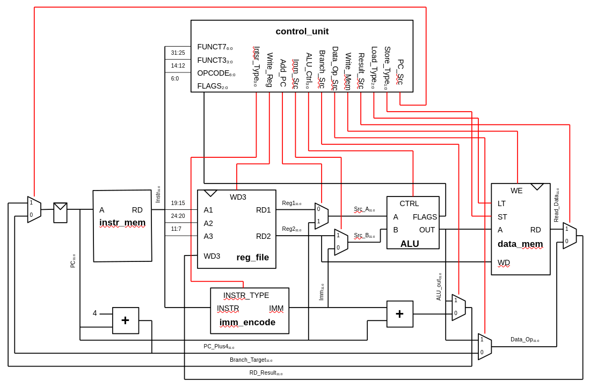

# Simple RISC-V 32-bits core
This project has the intention to build a functional RISC-V core (RV32I) on a FPGA. The FPGA objective will be the [Nexys-A7](https://digilent.com/reference/programmable-logic/nexys-a7/reference-manual) which use the Artix-7 FPGA core. This silicon is very accessible and popular, so it must work also in other boards. 
To build this core is intended to be written on SystemVerilog. I only will keep sources, testbenches and documentation because I wont be using Vivado at first but Verilator.

## Roadmap?
The project is intended to be a long term work. Always trying to improve, compare and extend the microarchitecture of this core for personal purposes.
